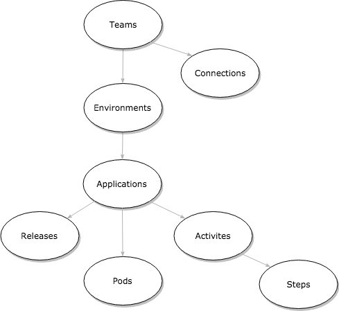
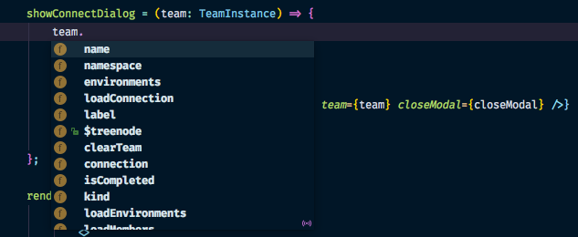

export { future as theme } from 'mdx-deck/themes'
import { CodeSurfer } from 'mdx-deck-code-surfer'

# State as a LIVING tree

---

    

---

## Is state management easy?

---

## NO!

---

## Challenges?

- data rehydration (snapshots)
- deeply nested structure
- handling references
- lazy loading
- app structure

---

## Data model

---

    

---

## MobX State Tree

---

> Opinionated, transactional, MobX powered state container combining the best features
> of the immutable and mutable world for an optimal DX

---

## React ... but for Data

---

- opinionated (as redux)
- types definitions
- lifecycle hooks
- reconciliation

---

## Types

---

<CodeSurfer
  title='Model'
  code={require('!raw-loader!./snippets/model.js')}
  lang='javascript'
  dark={false}
  steps={[
    {},
    { lines: [1], notes: 'Model as a tree node' },
    { lines: [2], notes: 'Used to reconcile items inside arrays and maps' },
    { range: [6, 9], notes: 'Supports complex types' },
    { tokens: { 7: [6] }, notes: 'Models can be nested' }
  ]}
/>

---

<CodeSurfer
  title='Nesting'
  code={require('!raw-loader!./snippets/model_simple.js')}
  lang='javascript'
  dark={false}
  steps={[
    {},
    { tokens: { 3: [6,7,8,9,10,11] }, notes: 'Keeps the data normalized in the background' },
  ]}
/>

---

<CodeSurfer
  title='Compose'
  code={require('!raw-loader!./snippets/type_compose.js')}
  lang='javascript'
  dark={false}
  steps={[
    {},
    { tokens: { 6: [6,7,8] }, notes: 'Creates a new model type' },
  ]}
/>

---

## Unique type system

- design (with typescript)
- and compile time (in the browser)

---

## Design time

    

---

## Compile time

    

---

> We can easily detect API issues with runtime type checking,
> by adding safety to the internal code.

---

## Opinionated

---

- state modeled as a tree
- context available based on the node location
- model actions can only modify their (sub)tree
- automatic rehydration from snapshots
- apply snapshots as JSON patch

---

<CodeSurfer
  title='Views'
  code={require('!raw-loader!./snippets/model_view.js')}
  lang='javascript'
  dark={false}
  steps={[
    {},
    { range: [7, 9], notes: 'Private data' },
    { range: [11, 13], notes: 'Computed values from MobX' },
  ]}
/>

---

<CodeSurfer
  title='Snapshots'
  code={require('!raw-loader!./snippets/model_snapshots.js')}
  lang='javascript'
  dark={false}
  steps={[
    {},
    { lines: [3], notes: 'Model definition' },
    { range: [7, 10], notes: 'Unserialize based on type definitons' },
  ]}
/>

---

<CodeSurfer
  title='JSON patch'
  code={require('!raw-loader!./snippets/json_patch.js')}
  lang='javascript'
  dark={false}
  steps={[
    {},
    { lines: [2], notes: 'Type of operation' },
    { lines: [3], notes: 'Path (like xpath)' },
    { lines: [4], notes: 'Value' },
  ]}
/>

---

<CodeSurfer
  title='Atomic'
  code={require('!raw-loader!./snippets/transaction.js')}
  lang='javascript'
  dark={false}
  steps={[
    {},
    { range: [2, 4], notes: 'Model definition' },
    { lines: [16], notes: 'Action to create a member' },
    { range: [6, 13], notes: 'Action with optimistic update' },
  ]}
/>

---

## And much more

---

- middlewares (undo manager)
- custom types (lazy loading)
- dependency injection (inject API client)
- lifecycle hooks

---

# One More Thing :)

---

## Known issues?

---

- extra runtime overhead (codesandbox)
- type inference is much faster in TypeScript 3.x (design time)
- problems with reference to itself (additional interface)

---

    

